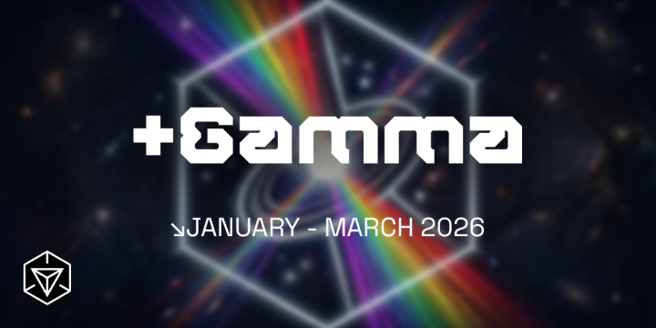
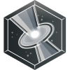
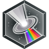

# Ingress +Gamma Anomaly Season

From January to March, Agents can take part in the **+Gamma** Anomaly Season, competing across multiple Events to earn the most Season Points for their Faction.

In addition, by taking part in some of these Events, Agents have multiple opportunities to earn medals.

* +Gamma Season Medal (3-tiered): Awarded based on participation in Ingress First Saturday events and performance in both Global Campaign and Anomaly battles.
  
  *Note: The Gold tier is reachable without attending any IFS events, provided performance in the Global Campaign and Anomaly battles is maximized.*
* Commemorative +Gamma Onsite Medal (single-tiered): Earned simply by participating in any Anomaly battle onsite.
* Global Campaign Medal (3-tiered): Based solely on performance during the Global Campaign.

## **Table of Contents**

1. [+Gamma Season medal](#season-medal)
2. [Event Schedule](#event-schedule)
3. [In Game Store](#ingress-store)

-----------------------------------------------------------------------------

## +Gamma Season medal

The **+Gamma** Season medal is a 3-tiered medal:

* Bronze: Unlocked at 500 +Gamma Tokens
* Silver: Unlocked at 3,000 +Gamma Tokens
* Gold: Unlocked at 7,500 +Gamma Tokens

  

Agents may earn the **+Gamma** medal by accumulating **+Gamma Tokens** through the following means:

* In-person First Saturday Events
  * Earn 2,500 **+Gamma Tokens** per month by attending and checking in with an onsite IFS organizer
* Global Campaigns
  * Earn up to 7,000 **+Gamma Tokens** from +Gamma Global Campaign
* Anomalies
  * Earn up to 5,000 **+Gamma Tokens** from the Anomaly Campaign at a +Gamma Anomaly event site
* (Tentatively) Special Events

A **+Gamma Token** Agent Stat will be added to your Agent Profile for the duration of the **+Gamma** Anomaly Season to help you monitor your individual progress.

-----------------------------------------------------------------------------

## Event Schedule

The **+Gamma** Anomaly Season, will take place during the months of January, February and March 2026.

Listed below are ways Agents can contribute to their Faction’s victory, and work towards their medal, during this period.

| Placeholder | Where | When | Details | Season Points | +Gamma Tokens |
| --- | --- | --- | --- | --- | --- |
|+Gamma First Saturdays | In-person First Saturday Events. | 3 Jan 2026,  7 Feb 2026,  and 7 Mar 2026 | Attend and check in at an onsite IFS event. | Each verified attendant earns their Faction 0.1 Season Point. The total Season Point earned per Faction is capped at 300.  *An individual Agent’s Faction is determined at the time the IFS medal is awarded.*  *Each Agent will only be credited once per month, regardless of how many IFS events they attended that month.* | Verified Agents will receive 2,500 +Gamma Tokens, alongside their IFS medal tick, by the end of the month. |

### +Gamma Anomaly Season Scoring

The final outcome of the **+Gamma** Anomaly Season will be based on the total Season Score accrued by each Faction from all of the above components, and the Faction with the higher final score will claim the Season.

For more details about how each component will contribute to the Season Score, see the associated sections for each component.

-----------------------------------------------------------------------------

## Available in the In-game Ingress Store

The Store will feature the +Gamma Supporter, +Gamma C.O.R.E. Supporter, P.A Chapeau, Yuen Ni, and Tycho medals with an updated 2026 design during the Season of +Gamma. Stay tuned!

 

-----------------------------------------------------------------------------

Agents, your feedback and counsel have been instrumental and continually guide our tactical approach.

Remain vigilant. In your pursuits of XM research and missions, strict compliance with local health and security regulations is essential.

For ongoing updates on Ingress field activities and strategic initiatives, refer to our official communication channel routinely. Stay alert, stay ready.

— Ingress
